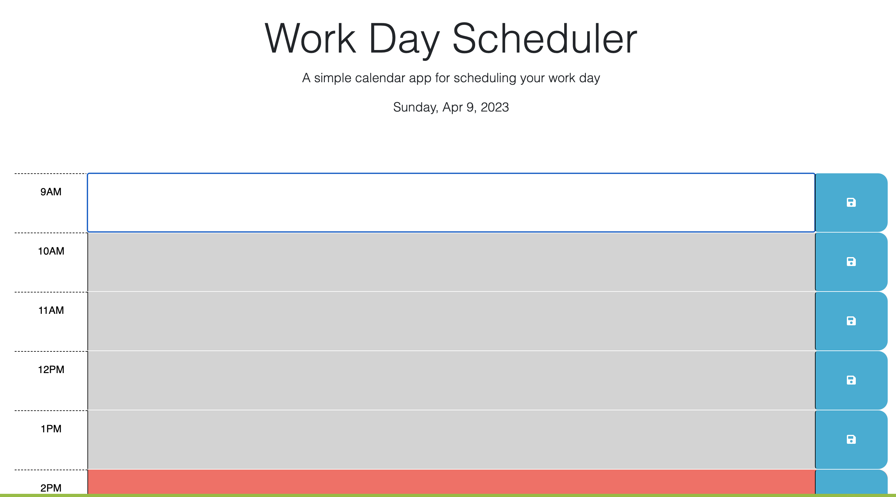

# Work Day Scheduler

## Discription 

Created a calendar application that allows a user to save events for each hour of the day using HTML script.js and CSS, jQuery .

## Deployed link for this weeks challange 

https://tujiabdulaya.github.io/Tuji_Work_Day_Scheduler_Repository/

https://github.com/tujiabdulaya/Tuji_Work_Day_Scheduler_Repository

